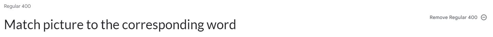

# *GlottoLotto* Matching Card Game

[Link to the page](https://vero-nika-2828.github.io/GlottoLotto_Matching-game/)

# Project Overview

GlottoLotto matching card game is a fun memory game designed with the aim to help students of English language to improve their skills and prompt them to practice the language outside of the classroom. While playing the game, the user will get opportunity not only to revise or learn new vocabulary but they will be able to practice the pronunciation of individual words and relate those words to the relevant concept.

The objective of the game is for the user to  match an English word to the corresponding picture by selecting two cards at each turn from the the grid of 16 cards. There are two levels to choose from: A1-A2 and B1-B2 with suitable difficulty of words for each level. The words in each category were selected based on the dificulty indication on Cambridge Dictionary Website. The user will keep turning the cards until all pairs are found or until the time limit is reached. 

# Project objectives

## User Goals

* I want to improve my English language skills
* I want to practice or learn the language in an engaging way 
* I want to have fun while learning
* I want a game that is suitable for my level
* I want a game that helps with memorising new vocabulary and with pronunciation
* I want a game that is easy to understand 

## Site Owner Goals

* Provide educational tool for students of English language
* Enable students to practice the language outside of the classroom
* Evoke insterest among students to learn English
* Accommodate needs of learner with different langauge abilities
* Help them to expand their vocabulary, practice pronunciation, and link the concepts

# User Experience

## User Stories

### Target user

* ESOL students - (English as Second Language) 
* EFL students - (English as Foreigner language)
* Adults and Childre

### First Time Visitor Goals

1. I want to be able to find out effortlessly what this website is for  
2. I want to be able to quickly identify where I can find different elements of the website and get to them
3. I want to be able to read instructions on how to play this game
4. I want to be able to play a game suitable for my level
5. I want to be able to play the game on variety of devices effortlessly 
6. I want to see whether I am improving 
7. I want to be able to return to main menu easily 
8. I want to be able to replay the game of the same level 
9. I want the new game to have the cards in different places so it doesn't become too easy to find a match
10. I want to see clearly what I seleceted
11. I want to know how to pronounce each word
12. I want to know when I got the match
13. I want to know when I didn't get the match 
14. I want to get a chance to memorise the position of the cards I selected 
15. I want to see how much time I have left to finish the game 
16. I want to see how many turns I have taken 
17. I want to know whether I won or lost when the game is finished 
18. I want to see my score
19. I want to keep track of my score
20. I want it to be clear when my score gets saved 
21. I want to be able to control the music of the game

### Returning Visitor Goals

22. I want to be able to directly to play the game 
23. I want to see my scores
24. I want to be able to progress in the game

### Site owner's Goals

25. I want to ensure that users know what this game is for and how to play it 
26. I want to make it obvious to the user wherre to find each element of the website
27. I want user to be able to navigate to the main menu easily 
28. I want users to enjoy the game and keep the difficulty to their level 
29. I want returning users to go directly to the game 
30. I want users to be able to re-play the game of the same difficulty 
31. I want to make the game interesting for users by changing the position of cards with each new game
32. I want users to have enough time memorise where each card is placed
33. I want them to indicate to the users when they did or did not find the match 
34. I want users to be able to practice pronunciation 
35. I wnat to make it easy for users to learn different concepts 
36. I want users to see that they are improving 
37. I want to challenge the user by giving them time limit 
38. I want users to see how many turns they have taken during the game
39. I want users to have some background music if they wish to listen to it
40. I want users to be be able to access my github to view more projects
41. I want to notify the user when they open a page that doesnt exist 
42. I want to make it easy for the user to get back to my page from non-existent page

# Design

## Design choices

The site will be visited by students of English language. The students are expected to have diverse level of knowledge of English language and to belong to different age groups. The website should appealing to adults as well as children and in order to encourage users to keep practicing the language and enjoy it, rather than see it as an obligation, design elements should aid with evoking friendliness, positivity, playfullness and confidence.

## Colour scheme

The main colors of the website are dark green, gold yellow, pink and white. 
* Dark green (#00483E) is used as a background color for all the containers: Main menu, Card area and Resull to provide a contrast for the text and to evoke a positive and relaxed feelings.

* Gold yellow (#D79E06) color was used for all the text apart from the button text to complement the dark green background and give the page a happy joyful feel. 

* Pink color (#CF9EAC) was used as the button color. This color diverges slightly from the background and description colors and was chosen with aim to bring the users attention to the navigation menu. It is also asociate with plaufulness which is the mood we want to set before the game.

* White color (#FFFFFF) was used as a button text for the contrast. 

* Brighter shades of pink (#FABEB4, #FCA99B) and ligher shade of (#00C9AC) were used to create linear gradient on the back of the card.

* Dark purple (#800080) and dark blue (#0000FF) used for the linear gradient for on the front of the cards to make the pictures and text stand out.

* Gray (#E9EEF1) and is used for the screen background.

## Typography

Google Fonts website was used to import the fonts chosen for this website.

Lato was used as a general font for the website. Marhey was used for headers, button text for emphasis and to keep with the playful and friendly theme. San seriff was added in case browser doesn't support the other two fonts. 

## Imagery

Images used for the cards were selected from pixabay with the theme of cartoon animals and the images for background were selected from Pexels

## Sound 

Sound used was selected from pixabay 

## Wireframes

Home

 

 

Portfolio

 

 

Contact

 

 

# Features

## Main menu

### Game name and game type description

* is situated above the Main menu area 
* presents the game to the user
* gives a clue that the user will be required to match the cards
* specifies who the game is for
* user stories it relates to: 1, 25

### Game desciption

* positioned in the center of the page 
* header propts users to try the game and indicates that they will leran by doing 
* the text beneath the header gives a brief description of the game, its purpose and the variety of levels
* user stories it relates to: 1, 25

### Navigation buttons 

* positioned under the description
* number of buttons limited to 3 to aid intutive navigation across the options
* direct the users to desired element 
* assigned name of each button gives a clear indication to the users where it will take them
* made more evident by the use of the pink color which distinguishes itself from the backround color 
* user stories it relates to: 2, 26

### How to play
 
* shows steps by step instructions of the game
* user can return to the main menu from here  
* vertical scroll bar activates for the smaller devices
* user stories it relates to: 3

### Play

* gives the users the choice of two levels: A1 -A2 and B1 -B2
* A1 - A2 has lower difficulty with words suitable for beginners
* B1 - B2 has lower difficulty with words suitable for intermediate
* gives option of progressing in the game to a higher level, from beginner to intermediate
* separate button allows users to go directly to the game
* allows user to return to main menu
* user stories it relates to: 22, 29

### Score board

* shows the scores aquired by the user with each try
* limits the number of the scores saved to 10
* when opened before the scores are added it informs the user to play the game and add the score
* user stories it relates to: 6, 19, 36

### Return button

* takes users back to main menu
* user stories it relates to: 7, 27

### Level options 

* level A1 -A2 for beginers on the top 
* level B1 -B2 for intermediate students under the beginner level 
* direct the user to the difficulty of their choice 
* word difficulty based on the Cambridge Dictionary online
* user stories it relates to: 4, 27

## Game page

* card area is centered to fit each devices' screen size wihtout activating scroll bar
* user stories it relates to: 5

### Title 

* positioned on the top of the page above the card container
* indicates what level the user is playing 
* shows short instructions of what the user is expected to do, thus match the word to the picture* user stories it relates to: 1, 25

### Timer 
* start as soon as the game is loaded
* goes down by one second
* user stories it relates to: 15, 37

### Turns
* with each two cards selected a turn coutner goes up by one
* user stories it relates to: 16, 38

### Music control

* music is muted when the game starts
* speaker icon  is crossed to indecate that music is off
* when clicked on the music starts playing and the cross is removed from the speaker button to in
* when clicked cross is removed from the speaker button to indicate that the sound is on
* user stories it relates to: 21, 39

### Card

* game consists of 16 cards in a grid of 4 columns and 4 rows
* cards are styled to fit variety of screen sizes without scrolling
* there are 8 matches in total for both levels
* front of the card shows either a word or an image
* with start of every game the position of cards changes
* each card flips around when the user clicks on it
* the animal name is being said each time card flips around
* when two selected cards match, the cards dissaper and sound effect indicates the correct match
* the selected cards stay up for a while before match or no match is being signalled in order for the user to memorise the position of the cards or see the cars they matched
* it is not possible to click the same card twice in the row
* when two selected cards don't match, the cards turn back and back of the card is shown
* user stories it relates to: 5, 9, 10, 11, 12, 13, 14, 31, 32, 33, 34, 35

## Result section

### Time's up

* appears when time limit runs out and not all matches are found 
* the message 'Time's up' indicates that the user ran out of time
* provides 'Try again button' to enable the user to replay the game right away
* provide 'Main menu button' to enable user get back to main menu and choose from the options
* user stories it relates to: 17

### Well done 

* appears when all 8 matches are found
* the message 'Well done' indicates that the user was succesful at the game
* is positioned right above the message about the gained points
* user stories it relates to: 17

### Points gained

* shows the total amount of points gained at the end of the game
* calculate based on the amount of turns taken to fnd all the matches - the less tries the more points
* is positioned right under the 'Well done message'
* user stories it relates to: 18, 36

### Name input

* enables saving users' name together with their score into the score board
* it is an imput field located under the points section
* shows placeholder message
* the placeholder message dissapears when name is typed in
* the name input disapears when saved button is clicked to indicate to the users that the name was added
* user stories it relates to: 19, 36

### Save score button 

* saves the users' name and score into the scoreboard
* the button text 'Save to the score board' indicates to the users that the name will be saved when they clicked on it
* the button text changes to 'Saved' to confirm to the users that the name got added
* is located under the input field 
* user stories it relates to: 19, 20

### Play again

* enables to users to play the same level game again with one click after finishing
* is positioned bellow result modal whether it is Time's up when game is lost or 'Well done' when the users win the game
* user stories it relates to: 8, 30

### Main menu

* enables the user to return to the main menu when the is finished
* it is positoned under 'Play again button' in result modal
* user stories it relates to: 2, 27

## Footer
### Link to github page

* link enables users to visit site owner's git hub page
* user stories it relates to: 40

## 404 error page
### Error notification

* appears when users click on the non-existen or incorrect link for either of the levels 
* message notifies the user that the page for that game was not found 

* is positioned above the message to return to the GlottoLotto game
* user stories it relates to: 41

### Back to game button

* enables users to return to the Main menu without using the navigation of the browser
* is positioned under the error message
* user stories it relates to: 42

## Future implementations

# Technologies Used 

## Languages Used
* HTML
* CSS
* Javascript

## Frameworks, libraries and programs used
 * [GitHub](https://github.com/vero-nika-2828/yasmin-jas-photography) - To save and store files and code for the website in a secure location 
  * [Gitpod](https://gitpod.io/workspaces) - A cloud based IDE used for version control, development of the code to build the website and to commit and push to GithHb
 * [Bootstrap](https://getbootstrap.com/docs/5.2/getting-started/introduction/) - Bootstrap grid used for the buttons
 * [jQuery](https://jquery.com/) - For the coding
 * [Google Fonts](https://fonts.google.com/) - For the typography on the website
 * [Font Awesome](https://fontawesome.com/) - For the iconography on the website
 * [Balsamiq](https://balsamiq.com/) - To create wireframes
 * Google Dev Tools - To troubleshoot and test features, solve issues with responsiveness and styling
 * [Tiny PNG](https://tinypng.com/) - To compress the pictures
 * [Emoji Cursor](https://www.emojicursor.app/) - For the shamrock cursor 
 * [Am I Responsive](https://ui.dev/amiresponsive) - To show the website image on a range of devices

# Testing
Find the full testing documented in [TESTING.md](TESTING.md)

# Deployment & local development

## Deployment 
The site is deployed using GitHub Pages and link can be found [here](https://vero-nika-2828.github.io/GlottoLotto_Matching-game/)

To Deploy the site using GitHub pages:

1. Log in (or sign up) to Github.
2. Go to the repository for this project, *vero-nika-2828/GlottoLotto_Matching-game*
3. Click the settings button.
4. Select pages in the left hand navigation menu.
5. From the source dropdown select main branch and press save.
6. The site has now been deployed, please  note that this process may take a few minutes before site goes live.

## Local Development

### How to Fork 

1. Log in (or sign up) to Github.
2. Go to the repository for this project, *vero-nika-2828/GlottoLotto_Matching-game*
3. Click the Fork button in the top right corner 

### How to Clone

1. Log in or (sign up) to Github
2. Go to  the repository for this project, vero-nika-2828/GlottoLotto_Matching-game
3. Click on the code button  which is located to the left from the green Gitpod button
4. Select HTTPS
5. Copy the link shown
6. Open the terminal in your code editor
7. Change the current working directory to the location you want to use for the cloned directory
8. Type 'git clone' into the terminal
9. Paste the link you copied in step 5
10. Press enter 

Alternatively, you can click on Download ZIP

# Credits

## Media

Images and sounds were taken from [Pixabay](https://pixabay.com/) with an exception of background images which were taken from [Pexels](https://www.pexels.com/) and were posted by these authors:

### Images
* OpenClipart-Vectors 
   * [Cat](https://pixabay.com/vectors/animal-blue-cartoon-cat-feline-1297724/)
 
   * [Turtle](https://pixabay.com/vectors/animals-cartoon-green-happy-1298747/)

   * [Rabbit](https://pixabay.com/vectors/anthropomorphized-animals-bunny-1300338/)

   * [Lion ](https://pixabay.com/vectors/africa-animal-cat-lion-1300564/)

   * [Owl ](https://pixabay.com/vectors/bird-hole-nature-owl-brown-birds-1294865/)

* Clker-Free-Vector-Images
   * [Chicken(A1) Hen(B2)](https://pixabay.com/vectors/rooster-chick-livestock-hen-303418/)

   * [Whale ](https://pixabay.com/vectors/whale-humpback-blowhole-mammal-36828/)
   
   * [Pig ](https://pixabay.com/vectors/pig-animal-piglet-pork-hog-piggy-47920/)

 * DavidRockDesign 
   * [Cow](https://pixabay.com/vectors/cow-animal-livestock-farm-1501690/)

 * Glamazon 
   * [Monkey](https://pixabay.com/vectors/monkey-chimp-ape-chimpanzee-animal-474147/)

 * creozavr 
   * [Rhino](https://pixabay.com/vectors/rhinoceros-horn-cartoony-4004201/)

* bknis 
   * [Sheep](https://pixabay.com/vectors/lamb-sheep-cute-farm-animal-baby-1388937/)

* 15071479
   * [Elephant](https://pixabay.com/vectors/elephant-animal-cartoon-wildlife-6087079/)

* GraphicMama-team
   * [Crocodile](https://pixabay.com/vectors/crocodile-animal-wild-danger-1456038/)

* Игорь Альшин
   * [Background-image 404 page](https://www.pexels.com/photo/rubik-s-cube-on-book-2873277/) 

* cottonbro studio
   * [Background-image Main Menu and Game page](https://www.pexels.com/photo/blue-orange-and-yellow-triangle-illustration-4965816/) 

### Sounds 
* Kevin MacLeod 
   * [Background-music](https://incompetech.com/music/royalty-free/music.html), also accessible [here](https://incompetech.com/music/royalty-free/index.html?feels%5B%5D=Driving).  License: [Magic Escape Room Kevin MacLeod (incompetech.com) Licensed under Creative Commons: By Attribution 3.0 License](http://creativecommons.org/licenses/by/3.0/)

* Pixabay 
   * [Correct Answer](https://pixabay.com/sound-effects/success-1-6297/) 

## Code
   * *Shuffle cards function (shuffleDeck) * built based on Fisher Yates Shuffle algorithm found in [this tutorial](https://www.youtube.com/watch?v=3uuQ3g92oPQ&t=342s) 
   * *Save score Function (saveScore)* built folloting [this tutorial](https://www.youtube.com/watch?v=DFhmNLKwwGw&list=PLDlWc9AfQBfZIkdVaOQXi1tizJeNJipEx&index=9) 

For hambuger navigation menu I took inspiration from [this tutorial](https://www.youtube.com/watch?v=xXze-haVm7g), and I adjusted the code heavily in order to fit the needs of my website

## Aknowledgement

I would like to thank to following people who helped me along the way in completing this project: 
* My Code Institute mentor, Mitko Bachvarov, for his valuable advice and comprehensive guidance
* My tutor for being so patient with me and being there for me every time I had any questions
* Ed and Jason from Tutor support for helping me with some issues I came across in my project
* My family and friends for giving me moral support and for taking time to test the final version of the project

