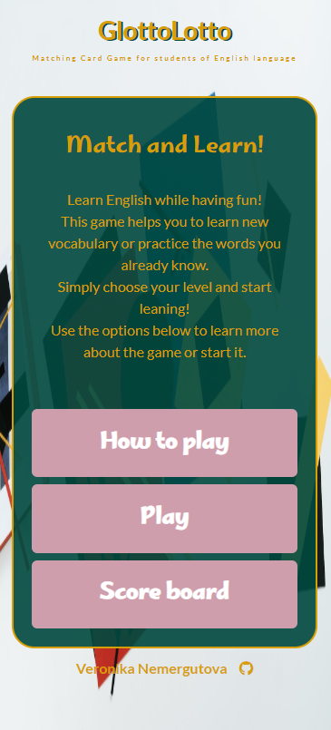
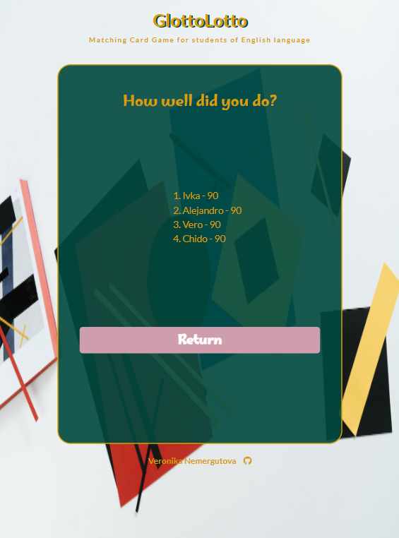

# Testing

## Automated Testing 

### CSS Validator (W3C)
 * HTML Validator 
   * index.html (Main Menu) - pass
      

      
Main Menu

       

      

      
 

   * level-A1.html - pass

      

      
Level A1 - A2

       

      

      
 

   * level-B1.html - pass
     

     
Level B1 - B2

      

     

    
  

 * CSS Validator -pass
    
   

   
CSS Validator screenshot

    
 
   

   
  

  * Javascript Validator (https://jshint.com/) -pass

    

    
JSHINT Validator screenshot

     
  
    

    
   

### Lighthouse

Main Menu

 

* Desktop

* Mobile

 

Level A1 -A2

 

 

Level B1 -B2

 

 

## Manual testing

### Testing user stories (Real user testing)

 User 1:   Device -  Samsung Galaxy S9, Browser: Samsung Browser

 

 Main page

 

| User stories | Feature | Expected result | Actual result |
|  :---| :---|  :---|  :---|
| 5  | Layout | Game as well as initial page and result fit the screen size and there is no need to sroll | Works as expected |
| 2  | Layout | All elements are visible  | Works as expected|
| 25 | Game name and game type description | Gives indication of the game type and who it is for| Works as expected|
| 1, 25 | Introduction to the game | Gives the description of the game and it's use | Works as expected|
| 2, 26 | Navigation buttons | Give me clear indication on where they will take me and are easy to read and it is intuitive| Works as expected|
|3 | Navigation buttons - How to play | When I click 'How to play' button it takes me to How to play section | Works as expected|
|3 | Navigation buttons - How to play on smaller devices| Instructions are easy to read and on smaller devices I have scroll option | Works as expected|
|4, 22, 29 | Navigation buttons  -Play | When I click 'Play buton'  it takes me to game options | Works as expected|
| 6, 36 | Navigation buttons  -Score board | When I click 'Score board'  it takes me to Scoreboard section | Works as expected|
| 7, 27 | Return button | When I click return button it takes me back to the main menu |
| 4, 27 | Play modal | I have two options of the games A1-A2 and  B1-B2 | Works as expected|
| 19, 36 | Score board | My score appears on the board | Works as expected|
| 4, 27 | Level options  A1-A2  button | A1-A2  button takes me to  A1-A2  game | Works as expected|
| 4, 24, 27 | Level options  B1-B2 button | B1-B2 button takes me to B1-B2 game|

 

 Game page

 

| User stories | Feature | Expected result | Actual result |
|  :---| :---|  :---|  :---|
| User stories | Feature | Expected result | Actual result |
|  :---| :---|  :---|  :---|
| 15, 37 | Timer | Time starts as soon as the games loads | Works as expected|
| 15, 37 | Timer | Goes down by second | Works as expected|
| 16,38 | Turns | When I select two cards the counter of the turns goes up 1 both when they match and don’t match | Works as expected|
| 21, 39 | Music | When I click on the crossed speaker icon the cross is removed and the music starts playing |
| 5 | Cards | Card area fiths my screen size | Works as expected|
| 5 | Card  | When game loads there are 16 cards of the same color  |  Works as expected |
| 35 | Card  | When I click a card of my choice it turns around and I see a picture or a word  |  Works as expected |
| 11, 34 | Card  | Each time card turns  hear the pronunciation of the animal name |  Works as expected |
| 10 | Card  | When I click the card that is alreay selected  it doesn’t react : no animal name is said or card is not turned  |  Works as expected |
| 12 | Card  | When I find a match the cards dissaper and sound effect is played |  Works as expected |
| 13, 33 | Card  | When I don’t find a match cards turn back around  |  Works as expected |
| 10, 34 | Card  | When I click area where cards which I matched used to be it doesn’t react: no animal name is said neither can I hear a matched sound  |  Works as expected |
| 10, 14, 32 | Card | When I select two cards they stay face up long enough to see what picture or word is on the card |  Works as expected |
| 9, 31 | Card | With each new game cards are in a different position  |  Works as expected |

 

 Result section

 
 
| User stories | Feature | Expected result | Actual result |
|  :---| :---|  :---|  :---|
| 17 | Time's up | When 2 minutes are over the game finished and Time'us message pop's up |  Works as expected |
| 17 | Well done  | When all pairs are matched Well done message pop's up |  Works as expected |
| 18, 36 | Points  | Underneath  the Well done message I can see how many points I earned  |  Works as expected |
| 19,36 | Input  | Input field shows text "Write your name here "  |  Works as expected |
| 19,36 | Input  | When I type anything in the field it overrides the placeholder message |  Works as expected |
| 19 | Save to the scoreboard button  | When I click save to the  score board button it saves my name in the scoreboard |  Works as expected |
| 19 | Save to the scoreboard button  | When I click save to the  score board button it saves my name in the scoreboard |  Works as expected |
| 20 | Save to the scoreboard button  | When I click save to the  score board button the text of the button changes to Saved  |  Works as expected |
| 8,30 | Try again button | When I click try again button it takes me to the same level  |  Works as expected |
| 2, 27 | Main menu button  | When I click Main menu  button it takes me to Main menu  |  Works as expected |

 

 Footer

 

| User stories | Feature | Expected result | Actual result |
|  :---| :---|  :---|  :---|
| 40 | Link | When I click link it opens on a new page |  Works as expected |
| 40 | Link | When I click link it takes me to git hub page |  Works as expected |

 

 404error page

 

| User stories | Feature | Expected result | Actual result |
|  :---| :---|  :---|  :---|
| 41 | 404. html | When the game is not found I am directed to the page that tell me that the page is not found |  Works as expected |
| 42 | Back to the game button | When I click the back to the game button it takes me back to the the Main menu  |  Works as expected |

 

 

 User 2:   Device -  Huawei P30 Lite, Browser: Huawei browser

 

 Main page

 

| User stories | Feature | Expected result | Actual result |
|  :---| :---|  :---|  :---|
| 5  | Layout | Game as well as initial page and result fit the screen size and there is no need to sroll | Works as expected |
| 2  | Layout | All elements are visible  | Works as expected|
| 25 | Game name and game type description | Gives indication of the game type and who it is for| Works as expected|
| 1, 25 | Introduction to the game | Gives the description of the game and it's use | Works as expected|
| 2, 26 | Navigation buttons | Give me clear indication on where they will take me and are easy to read and it is intuitive| Works as expected|
|3 | Navigation buttons - How to play | When I click 'How to play' button it takes me to How to play section | Works as expected|
|3 | Navigation buttons - How to play on smaller devices| Instructions are easy to read and on smaller devices I have scroll option | Works as expected|
|4, 22, 29 | Navigation buttons  -Play | When I click 'Play buton'  it takes me to game options | Works as expected|
| 6, 36 | Navigation buttons  -Score board | When I click 'Score board'  it takes me to Scoreboard section | Works as expected|
| 7, 27 | Return button | When I click return button it takes me back to the main menu |
| 4, 27 | Play modal | I have two options of the games A1-A2 and  B1-B2 | Works as expected|
| 19, 36 | Score board | My score appears on the board | Works as expected|
| 4, 27 | Level options  A1-A2  button | A1-A2  button takes me to  A1-A2  game | Works as expected|
| 4, 24, 27 | Level options  B1-B2 button | B1-B2 button takes me to B1-B2 game|

 

 Game page

 

| User stories | Feature | Expected result | Actual result |
|  :---| :---|  :---|  :---|
| User stories | Feature | Expected result | Actual result |
|  :---| :---|  :---|  :---|
| 15, 37 | Timer | Time starts as soon as the games loads | Works as expected|
| 15, 37 | Timer | Goes down by second | Works as expected|
| 16,38 | Turns | When I select two cards the counter of the turns goes up 1 both when they match and don’t match | Works as expected|
| 21, 39 | Music | When I click on the crossed speaker icon the cross is removed and the music starts playing |
| 5 | Cards | Card area fiths my screen size | Works as expected|
| 5 | Card  | When game loads there are 16 cards of the same color  |  Works as expected |
| 35 | Card  | When I click a card of my choice it turns around and I see a picture or a word  |  Works as expected |
| 11, 34 | Card  | Each time card turns  hear the pronunciation of the animal name |  Works as expected |
| 10 | Card  | When I click the card that is alreay selected  it doesn’t react : no animal name is said or card is not turned  |  Works as expected |
| 12 | Card  | When I find a match the cards dissaper and sound effect is played |  Works as expected |
| 13, 33 | Card  | When I don’t find a match cards turn back around  |  Works as expected |
| 10, 34 | Card  | When I click area where cards which I matched used to be it doesn’t react: no animal name is said neither can I hear a matched sound  |  Works as expected |
| 10, 14, 32 | Card | When I select two cards they stay face up long enough to see what picture or word is on the card |  Works as expected |
| 9, 31 | Card | With each new game cards are in a different position  |  Works as expected |

 

 Result section

 
 
| User stories | Feature | Expected result | Actual result |
|  :---| :---|  :---|  :---|
| 17 | Time's up | When 2 minutes are over the game finished and Time'us message pop's up |  Works as expected |
| 17 | Well done  | When all pairs are matched Well done message pop's up |  Works as expected |
| 18, 36 | Points  | Underneath  the Well done message I can see how many points I earned  |  Works as expected |
| 19,36 | Input  | Input field shows text "Write your name here "  |  Works as expected |
| 19,36 | Input  | When I type anything in the field it overrides the placeholder message |  Works as expected |
| 19 | Save to the scoreboard button  | When I click save to the  score board button it saves my name in the scoreboard |  Works as expected |
| 19 | Save to the scoreboard button  | When I click save to the  score board button it saves my name in the scoreboard |  Works as expected |
| 20 | Save to the scoreboard button  | When I click save to the  score board button the text of the button changes to Saved  |  Works as expected |
| 8,30 | Try again button | When I click try again button it takes me to the same level  |  Works as expected |
| 2, 27 | Main menu button  | When I click Main menu  button it takes me to Main menu  |  Works as expected |

 

 Footer

 

| User stories | Feature | Expected result | Actual result |
|  :---| :---|  :---|  :---|
| 40 | Link | When I click link it opens on a new page |  Works as expected |
| 40 | Link | When I click link it takes me to git hub page |  Works as expected |

 

 404error page

 

| User stories | Feature | Expected result | Actual result |
|  :---| :---|  :---|  :---|
| 41 | 404. html | When the game is not found I am directed to the page that tell me that the page is not found |  Works as expected |
| 42 | Back to the game button | When I click the back to the game button it takes me back to the the Main menu  |  Works as expected |

 

 

 User 3:   Device -  iPhone 13 mini, Browser: Safari

 

 Main page

 

| User stories | Feature | Expected result | Actual result |
|  :---| :---|  :---|  :---|
| 5  | Layout | Game as well as initial page and result fit the screen size and there is no need to sroll | Works as expected |
| 2  | Layout | All elements are visible  | Works as expected|
| 25 | Game name and game type description | Gives indication of the game type and who it is for| Works as expected|
| 1, 25 | Introduction to the game | Gives the description of the game and it's use | Works as expected|
| 2, 26 | Navigation buttons | Give me clear indication on where they will take me and are easy to read and it is intuitive| Works as expected|
|3 | Navigation buttons - How to play | When I click 'How to play' button it takes me to How to play section | Works as expected|
|3 | Navigation buttons - How to play on smaller devices| Instructions are easy to read and on smaller devices I have scroll option | Works as expected|
|4, 22, 29 | Navigation buttons  -Play | When I click 'Play buton'  it takes me to game options | Works as expected|
| 6, 36 | Navigation buttons  -Score board | When I click 'Score board'  it takes me to Scoreboard section | Works as expected|
| 7, 27 | Return button | When I click return button it takes me back to the main menu |
| 4, 27 | Play modal | I have two options of the games A1-A2 and  B1-B2 | Works as expected|
| 19, 36 | Score board | My score appears on the board | Works as expected|
| 4, 27 | Level options  A1-A2  button | A1-A2  button takes me to  A1-A2  game | Works as expected|
| 4, 24, 27 | Level options  B1-B2 button | B1-B2 button takes me to B1-B2 game|

 

 Game page

 

| User stories | Feature | Expected result | Actual result |
|  :---| :---|  :---|  :---|
| User stories | Feature | Expected result | Actual result |
|  :---| :---|  :---|  :---|
| 15, 37 | Timer | Time starts as soon as the games loads | Works as expected|
| 15, 37 | Timer | Goes down by second | Works as expected|
| 16,38 | Turns | When I select two cards the counter of the turns goes up 1 both when they match and don’t match | Works as expected|
| 21, 39 | Music | When I click on the crossed speaker icon the cross is removed and the music starts playing |
| 5 | Cards | Card area fiths my screen size | Works as expected|
| 5 | Card  | When game loads there are 16 cards of the same color  |  Works as expected |
| 35 | Card  | When I click a card of my choice it turns around and I see a picture or a word  |  Works as expected |
| 11, 34 | Card  | Each time card turns  hear the pronunciation of the animal name |  Works as expected |
| 10 | Card  | When I click the card that is alreay selected  it doesn’t react : no animal name is said or card is not turned  |  Works as expected |
| 12 | Card  | When I find a match the cards dissaper and sound effect is played |  Works as expected |
| 13, 33 | Card  | When I don’t find a match cards turn back around  |  Works as expected |
| 10, 34 | Card  | When I click area where cards which I matched used to be it doesn’t react: no animal name is said neither can I hear a matched sound  |  Works as expected |
| 10, 14, 32 | Card | When I select two cards they stay face up long enough to see what picture or word is on the card |  Works as expected |
| 9, 31 | Card | With each new game cards are in a different position  |  Works as expected |

 

 Result section

 
 
| User stories | Feature | Expected result | Actual result |
|  :---| :---|  :---|  :---|
| 17 | Time's up | When 2 minutes are over the game finished and Time'us message pop's up |  Works as expected |
| 17 | Well done  | When all pairs are matched Well done message pop's up |  Works as expected |
| 18, 36 | Points  | Underneath  the Well done message I can see how many points I earned  |  Works as expected |
| 19,36 | Input  | Input field shows text "Write your name here "  |  Works as expected |
| 19,36 | Input  | When I type anything in the field it overrides the placeholder message |  Works as expected |
| 19 | Save to the scoreboard button  | When I click save to the  score board button it saves my name in the scoreboard |  Works as expected |
| 19 | Save to the scoreboard button  | When I click save to the  score board button it saves my name in the scoreboard |  Works as expected |
| 20 | Save to the scoreboard button  | When I click save to the  score board button the text of the button changes to Saved  |  Works as expected |
| 8,30 | Try again button | When I click try again button it takes me to the same level  |  Works as expected |
| 2, 27 | Main menu button  | When I click Main menu  button it takes me to Main menu  |  Works as expected |

 

 Footer

 

| User stories | Feature | Expected result | Actual result |
|  :---| :---|  :---|  :---|
| 40 | Link | When I click link it opens on a new page |  Works as expected |
| 40 | Link | When I click link it takes me to git hub page |  Works as expected |

 

 404error page

 

| User stories | Feature | Expected result | Actual result |
|  :---| :---|  :---|  :---|
| 41 | 404. html | When the game is not found I am directed to the page that tell me that the page is not found |  Works as expected |
| 42 | Back to the game button | When I click the back to the game button it takes me back to the the Main menu  |  Works as expected |

 

 

 User 4:   Device -  Apple iPad mini, Browser: Safari

 

 Main page

 

| User stories | Feature | Expected result | Actual result |
|  :---| :---|  :---|  :---|
| 5  | Layout | Game as well as initial page and result fit the screen size and there is no need to sroll | Works as expected |
| 2  | Layout | All elements are visible  | Works as expected|
| 25 | Game name and game type description | Gives indication of the game type and who it is for| Works as expected|
| 1, 25 | Introduction to the game | Gives the description of the game and it's use | Works as expected|
| 2, 26 | Navigation buttons | Give me clear indication on where they will take me and are easy to read and it is intuitive| Works as expected|
|3 | Navigation buttons - How to play | When I click 'How to play' button it takes me to How to play section | Works as expected|
|3 | Navigation buttons - How to play on smaller devices| Instructions are easy to read and on smaller devices I have scroll option | Works as expected|
|4, 22, 29 | Navigation buttons  -Play | When I click 'Play buton'  it takes me to game options | Works as expected|
| 6, 36 | Navigation buttons  -Score board | When I click 'Score board'  it takes me to Scoreboard section | Works as expected|
| 7, 27 | Return button | When I click return button it takes me back to the main menu |
| 4, 27 | Play modal | I have two options of the games A1-A2 and  B1-B2 | Works as expected|
| 19, 36 | Score board | My score appears on the board | Works as expected|
| 4, 27 | Level options  A1-A2  button | A1-A2  button takes me to  A1-A2  game | Works as expected|
| 4, 24, 27 | Level options  B1-B2 button | B1-B2 button takes me to B1-B2 game|

 

 Game page

 

| User stories | Feature | Expected result | Actual result |
|  :---| :---|  :---|  :---|
| User stories | Feature | Expected result | Actual result |
|  :---| :---|  :---|  :---|
| 15, 37 | Timer | Time starts as soon as the games loads | Works as expected|
| 15, 37 | Timer | Goes down by second | Works as expected|
| 16,38 | Turns | When I select two cards the counter of the turns goes up 1 both when they match and don’t match | Works as expected|
| 21, 39 | Music | When I click on the crossed speaker icon the cross is removed and the music starts playing |
| 5 | Cards | Card area fiths my screen size | Works as expected|
| 5 | Card  | When game loads there are 16 cards of the same color  |  Works as expected |
| 35 | Card  | When I click a card of my choice it turns around and I see a picture or a word  |  Works as expected |
| 11, 34 | Card  | Each time card turns  hear the pronunciation of the animal name |  Works as expected |
| 10 | Card  | When I click the card that is alreay selected  it doesn’t react : no animal name is said or card is not turned  |  Works as expected |
| 12 | Card  | When I find a match the cards dissaper and sound effect is played |  Works as expected |
| 13, 33 | Card  | When I don’t find a match cards turn back around  |  Works as expected |
| 10, 34 | Card  | When I click area where cards which I matched used to be it doesn’t react: no animal name is said neither can I hear a matched sound  |  Works as expected |
| 10, 14, 32 | Card | When I select two cards they stay face up long enough to see what picture or word is on the card |  Works as expected |
| 9, 31 | Card | With each new game cards are in a different position  |  Works as expected |

 

 Result section

 
 
| User stories | Feature | Expected result | Actual result |
|  :---| :---|  :---|  :---|
| 17 | Time's up | When 2 minutes are over the game finished and Time'us message pop's up |  Works as expected |
| 17 | Well done  | When all pairs are matched Well done message pop's up |  Works as expected |
| 18, 36 | Points  | Underneath  the Well done message I can see how many points I earned  |  Works as expected |
| 19,36 | Input  | Input field shows text "Write your name here "  |  Works as expected |
| 19,36 | Input  | When I type anything in the field it overrides the placeholder message |  Works as expected |
| 19 | Save to the scoreboard button  | When I click save to the  score board button it saves my name in the scoreboard |  Works as expected |
| 19 | Save to the scoreboard button  | When I click save to the  score board button it saves my name in the scoreboard |  Works as expected |
| 20 | Save to the scoreboard button  | When I click save to the  score board button the text of the button changes to Saved  |  Works as expected |
| 8,30 | Try again button | When I click try again button it takes me to the same level  |  Works as expected |
| 2, 27 | Main menu button  | When I click Main menu  button it takes me to Main menu  |  Works as expected |

 

 Footer

 

| User stories | Feature | Expected result | Actual result |
|  :---| :---|  :---|  :---|
| 40 | Link | When I click link it opens on a new page |  Works as expected |
| 40 | Link | When I click link it takes me to git hub page |  Works as expected |

 

 404error page

 

| User stories | Feature | Expected result | Actual result |
|  :---| :---|  :---|  :---|
| 41 | 404. html | When the game is not found I am directed to the page that tell me that the page is not found |  Works as expected |
| 42 | Back to the game button | When I click the back to the game button it takes me back to the the Main menu  |  Works as expected |

 

 

 User 5:   Device -  Samsung Galaxy Tab A8, Browser: Samsung browser

 

 Main page

 

| User stories | Feature | Expected result | Actual result |
|  :---| :---|  :---|  :---|
| 5  | Layout | Game as well as initial page and result fit the screen size and there is no need to sroll | Works as expected |
| 2  | Layout | All elements are visible  | Works as expected|
| 25 | Game name and game type description | Gives indication of the game type and who it is for| Works as expected|
| 1, 25 | Introduction to the game | Gives the description of the game and it's use | Works as expected|
| 2, 26 | Navigation buttons | Give me clear indication on where they will take me and are easy to read and it is intuitive| Works as expected|
|3 | Navigation buttons - How to play | When I click 'How to play' button it takes me to How to play section | Works as expected|
|3 | Navigation buttons - How to play on smaller devices| Instructions are easy to read and on smaller devices I have scroll option | Works as expected|
|4, 22, 29 | Navigation buttons  -Play | When I click 'Play buton'  it takes me to game options | Works as expected|
| 6, 36 | Navigation buttons  -Score board | When I click 'Score board'  it takes me to Scoreboard section | Works as expected|
| 7, 27 | Return button | When I click return button it takes me back to the main menu |
| 4, 27 | Play modal | I have two options of the games A1-A2 and  B1-B2 | Works as expected|
| 19, 36 | Score board | My score appears on the board | Works as expected|
| 4, 27 | Level options  A1-A2  button | A1-A2  button takes me to  A1-A2  game | Works as expected|
| 4, 24, 27 | Level options  B1-B2 button | B1-B2 button takes me to B1-B2 game|

 

 Game page

 

| User stories | Feature | Expected result | Actual result |
|  :---| :---|  :---|  :---|
| User stories | Feature | Expected result | Actual result |
|  :---| :---|  :---|  :---|
| 15, 37 | Timer | Time starts as soon as the games loads | Works as expected|
| 15, 37 | Timer | Goes down by second | Works as expected|
| 16,38 | Turns | When I select two cards the counter of the turns goes up 1 both when they match and don’t match | Works as expected|
| 21, 39 | Music | When I click on the crossed speaker icon the cross is removed and the music starts playing |
| 5 | Cards | Card area fiths my screen size | Works as expected|
| 5 | Card  | When game loads there are 16 cards of the same color  |  Works as expected |
| 35 | Card  | When I click a card of my choice it turns around and I see a picture or a word  |  Works as expected |
| 11, 34 | Card  | Each time card turns  hear the pronunciation of the animal name |  Works as expected |
| 10 | Card  | When I click the card that is alreay selected  it doesn’t react : no animal name is said or card is not turned  |  Works as expected |
| 12 | Card  | When I find a match the cards dissaper and sound effect is played |  Works as expected |
| 13, 33 | Card  | When I don’t find a match cards turn back around  |  Works as expected |
| 10, 34 | Card  | When I click area where cards which I matched used to be it doesn’t react: no animal name is said neither can I hear a matched sound  |  Works as expected |
| 10, 14, 32 | Card | When I select two cards they stay face up long enough to see what picture or word is on the card |  Works as expected |
| 9, 31 | Card | With each new game cards are in a different position  |  Works as expected |

 

 Result section

 
 
| User stories | Feature | Expected result | Actual result |
|  :---| :---|  :---|  :---|
| 17 | Time's up | When 2 minutes are over the game finished and Time'us message pop's up |  Works as expected |
| 17 | Well done  | When all pairs are matched Well done message pop's up |  Works as expected |
| 18, 36 | Points  | Underneath  the Well done message I can see how many points I earned  |  Works as expected |
| 19,36 | Input  | Input field shows text "Write your name here "  |  Works as expected |
| 19,36 | Input  | When I type anything in the field it overrides the placeholder message |  Works as expected |
| 19 | Save to the scoreboard button  | When I click save to the  score board button it saves my name in the scoreboard |  Works as expected |
| 19 | Save to the scoreboard button  | When I click save to the  score board button it saves my name in the scoreboard |  Works as expected |
| 20 | Save to the scoreboard button  | When I click save to the  score board button the text of the button changes to Saved  |  Works as expected |
| 8,30 | Try again button | When I click try again button it takes me to the same level  |  Works as expected |
| 2, 27 | Main menu button  | When I click Main menu  button it takes me to Main menu  |  Works as expected |

 

 Footer

 

| User stories | Feature | Expected result | Actual result |
|  :---| :---|  :---|  :---|
| 40 | Link | When I click link it opens on a new page |  Works as expected |
| 40 | Link | When I click link it takes me to git hub page |  Works as expected |

 

 404error page

 

| User stories | Feature | Expected result | Actual result |
|  :---| :---|  :---|  :---|
| 41 | 404. html | When the game is not found I am directed to the page that tell me that the page is not found |  Works as expected |
| 42 | Back to the game button | When I click the back to the game button it takes me back to the the Main menu  |  Works as expected |

 

 

 User 6:   Device -  Desktop, Browser: Chrome

 

 Main page

 

| User stories | Feature | Expected result | Actual result |
|  :---| :---|  :---|  :---|
| 5  | Layout | Game as well as initial page and result fit the screen size and there is no need to sroll | Works as expected |
| 2  | Layout | All elements are visible  | Works as expected|
| 25 | Game name and game type description | Gives indication of the game type and who it is for| Works as expected|
| 1, 25 | Introduction to the game | Gives the description of the game and it's use | Works as expected|
| 2, 26 | Navigation buttons | Give me clear indication on where they will take me and are easy to read and it is intuitive| Works as expected|
|3 | Navigation buttons - How to play | When I click 'How to play' button it takes me to How to play section | Works as expected|
|3 | Navigation buttons - How to play on smaller devices| Instructions are easy to read and on smaller devices I have scroll option | Works as expected|
|4, 22, 29 | Navigation buttons  -Play | When I click 'Play buton'  it takes me to game options | Works as expected|
| 6, 36 | Navigation buttons  -Score board | When I click 'Score board'  it takes me to Scoreboard section | Works as expected|
| 7, 27 | Return button | When I click return button it takes me back to the main menu |
| 4, 27 | Play modal | I have two options of the games A1-A2 and  B1-B2 | Works as expected|
| 19, 36 | Score board | My score appears on the board | Works as expected|
| 4, 27 | Level options  A1-A2  button | A1-A2  button takes me to  A1-A2  game | Works as expected|
| 4, 24, 27 | Level options  B1-B2 button | B1-B2 button takes me to B1-B2 game|

 

 Game page

 

| User stories | Feature | Expected result | Actual result |
|  :---| :---|  :---|  :---|
| User stories | Feature | Expected result | Actual result |
|  :---| :---|  :---|  :---|
| 15, 37 | Timer | Time starts as soon as the games loads | Works as expected|
| 15, 37 | Timer | Goes down by second | Works as expected|
| 16,38 | Turns | When I select two cards the counter of the turns goes up 1 both when they match and don’t match | Works as expected|
| 21, 39 | Music | When I click on the crossed speaker icon the cross is removed and the music starts playing |
| 5 | Cards | Card area fiths my screen size | Works as expected|
| 5 | Card  | When game loads there are 16 cards of the same color  |  Works as expected |
| 35 | Card  | When I click a card of my choice it turns around and I see a picture or a word  |  Works as expected |
| 11, 34 | Card  | Each time card turns  hear the pronunciation of the animal name |  Works as expected |
| 10 | Card  | When I click the card that is alreay selected  it doesn’t react : no animal name is said or card is not turned  |  Works as expected |
| 12 | Card  | When I find a match the cards dissaper and sound effect is played |  Works as expected |
| 13, 33 | Card  | When I don’t find a match cards turn back around  |  Works as expected |
| 10, 34 | Card  | When I click area where cards which I matched used to be it doesn’t react: no animal name is said neither can I hear a matched sound  |  Works as expected |
| 10, 14, 32 | Card | When I select two cards they stay face up long enough to see what picture or word is on the card |  Works as expected |
| 9, 31 | Card | With each new game cards are in a different position  |  Works as expected |

 

 Result section

 
 
| User stories | Feature | Expected result | Actual result |
|  :---| :---|  :---|  :---|
| 17 | Time's up | When 2 minutes are over the game finished and Time'us message pop's up |  Works as expected |
| 17 | Well done  | When all pairs are matched Well done message pop's up |  Works as expected |
| 18, 36 | Points  | Underneath  the Well done message I can see how many points I earned  |  Works as expected |
| 19,36 | Input  | Input field shows text "Write your name here "  |  Works as expected |
| 19,36 | Input  | When I type anything in the field it overrides the placeholder message |  Works as expected |
| 19 | Save to the scoreboard button  | When I click save to the  score board button it saves my name in the scoreboard |  Works as expected |
| 19 | Save to the scoreboard button  | When I click save to the  score board button it saves my name in the scoreboard |  Works as expected |
| 20 | Save to the scoreboard button  | When I click save to the  score board button the text of the button changes to Saved  |  Works as expected |
| 8,30 | Try again button | When I click try again button it takes me to the same level  |  Works as expected |
| 2, 27 | Main menu button  | When I click Main menu  button it takes me to Main menu  |  Works as expected |

 

 Footer

 

| User stories | Feature | Expected result | Actual result |
|  :---| :---|  :---|  :---|
| 40 | Link | When I click link it opens on a new page |  Works as expected |
| 40 | Link | When I click link it takes me to git hub page |  Works as expected |

 

 404error page

 

| User stories | Feature | Expected result | Actual result |
|  :---| :---|  :---|  :---|
| 41 | 404. html | When the game is not found I am directed to the page that tell me that the page is not found |  Works as expected |
| 42 | Back to the game button | When I click the back to the game button it takes me back to the the Main menu  |  Works as expected |

 

 

 

### Full Testing

The website was tested on following devices

Samsung Galaxy S9  360 x 740px 

<ul>

 

 
Main menu

 

 
 

 

 
Game

 

 
 

 

 
Result

 

 
 

  
404

 

 
 

</ul>

 

Huawei P30 Lite 360 x 780px

<ul>

 

 
Main menu

 

 
 

 

 
Game

 

 
 

 

 
Result

 

 
 

  

 
404 page

 

 
 

</ul>

 

iPhone 13 mini 375 x 812px

<ul>

 

 
Main menu

 

 
 

 

 
Game

 

 
 

 

 
Result

 

 
 

 

 
404 page

 

 
 

</ul>

 

Apple iPad mini 768 x 1024

<ul>

 

 
Main Menu 

 

 
 

 

 
Game

 

 
 

 

 
Result

 

 
 

  

 
404 page

 

 
 
</ul>

 

 

Samsung Galaxy Tab A8  1280 x 634px 

<ul>

 

 
Main Menu

 

 
 

  

 
Game

 

 
 

 

 
Result

 

 
 

 

 
404 page

 

 
 

</ul>

 

Desktop 1600 x 900px

<ul>

 

 
Main Menu

 

 
 

 

 
Game

 

 
 

 

 
Result

 

 
 

 

 
404 page

 

 
 

</ul>

 

</ul>

 

## Bugs

### Solved bugs 
 |  Expected |  Bug |  Fix |
 |  :---| :---|  :---|
 | Return buttons should take me to the main menu | Return button in 'How to play' or 'Play' section did not react and didn't take me back to the main menu|return function was moved inside the on click for #btn-instructions and  #btn-play function and that applied the return function als when those modals are open |
 | The user should see only the content for the chosen element when then open any of the navigation options : How to play, Play and Score board and the previvous content should not be seen  | When the How to play or play button was clicked it added the content of the modal to the main menu content and when clicked back to main content it added the content of the How to play to the bottom. The same happened in Play modal | The function to clear the existing text before adding new one was added 
 | The timer should always show one digit for minutes and two digits for seconds | When seconds went under 10 only one digit was displayed | The timeDecrease function was adjusted to add 0 to each digit when there is only one digit represingting seconds which usually happens when they are lower than  10 |
 |Music should play as soon as the user clicks on the speaker | The music took about  15 seconds to start playing | Thes size of the audio was trimmed and the loop was applied
 | When the user clicks on the area where the matched cards used be it should not react| The animal sound was played when clicked on the aread where matched pictures used to be and when clicked on two matching the sound was played |  Added condition to apply the cardTurns function only to those cards which dont have matched class
 | When match is found the cards fade out | The outline of the cards stayed visible  | Styling added to the card class (.card) to set the border to none |
 | When users clicks on the card and it flips only the front of the card should be visible| When card was fliped to the front of the card the white outline was visible in the background  | style propety was added to remove the visibility of the front card when it flips|
 |It is not possible for the user to submit their score if the input field is empty | The text got submitted even when the user didn't enter their name | The 'save to scoreboard' button was disabled and an even listener was added to remove the disabled attribute when the key is up

### Known bugs
There are no known bugs

